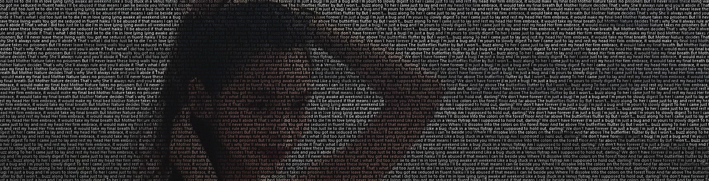
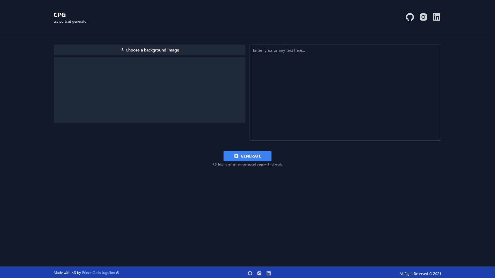

# CPG

 

 

CSS Portrait Generator | 👉 [TRY IT OUT](https://cpg.vercel.app) 👈

creating portait from css has been a trend lately so here is a no-code generator for the non tech-savy peeps out there who want to join in the trend/

---

## How to use

1. Click `Choose a background image` button
2. Enter the lyrics or text you want to overlay the image with
3. Click `Generate` :3

---

   

      <h5>
        Made with <3 by <a href="https://princecaarlo.tech/">Prince Carlo Juguilon</a> :3
      </h5>
   

   
   
   

